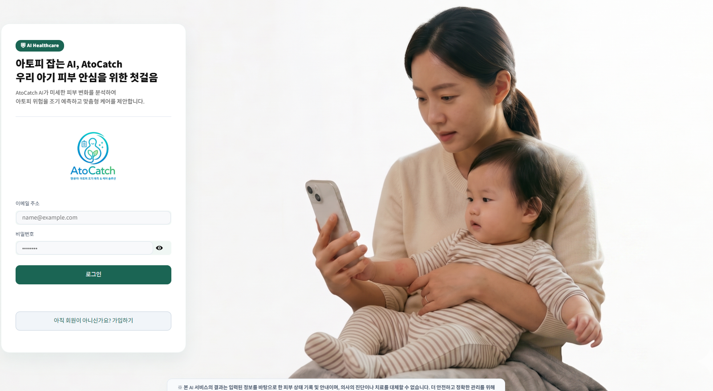
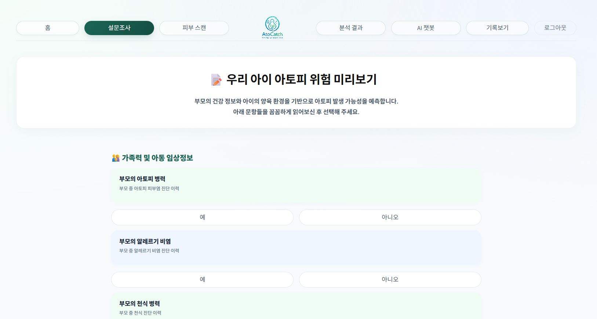
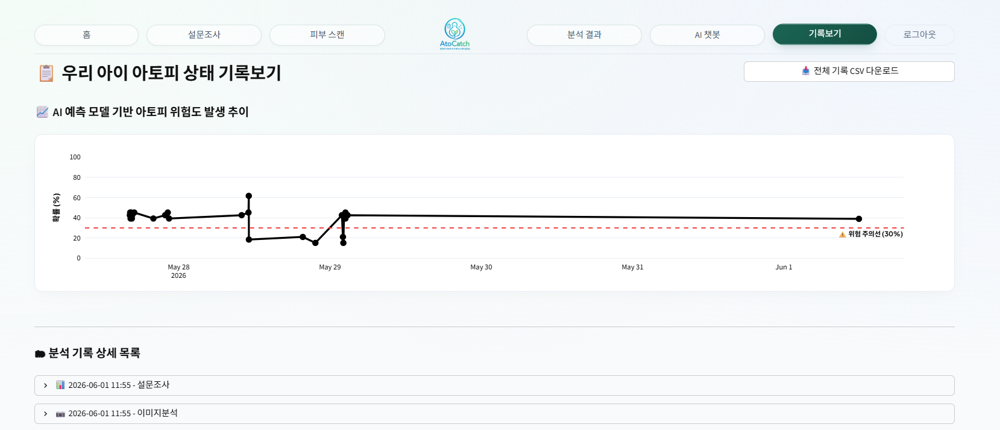

# AtoCatch 🩺
아토피 피부염 진단 보조 Streamlit 앱

## 스크린샷

| 로그인 | 홈 |
|--------|-----|
|  |  |

| 설문조사 | 피부 스캔 |
|----------|-----------|
|  |  |

| 분석 결과 | AI 챗봇 |
|-----------|---------|
|  |  |

| 기록보기 |
|----------|
|  |

## 기술 스택

| 분류 | 기술 |
|------|------|
| Frontend | Streamlit |
| 딥러닝 | PyTorch, timm (EfficientNetV2-S) |
| 머신러닝 | scikit-learn (로지스틱 회귀) |
| AI 챗봇 | OpenAI API, Anthropic API |
| 시각화 | GradCAM, Plotly |
| 데이터베이스 | Supabase, JSON |
| 인프라 | Python-dotenv, OpenCV |

## 모델 파일 다운로드

> `.pth` 파일은 용량 문제로 GitHub에 포함되지 않습니다. 아래 링크에서 받아 지정 경로에 위치시켜주세요.

| 파일 | 경로 | 다운로드 |
|------|------|----------|
| `best_model.pth` | `아토미 유무 모델/best_model.pth` | [Google Drive](https://drive.google.com/file/d/1khrt-QelCpdcf8PbDCvMb5kVnRc2evP5/view?usp=drive_link) |
| `best_iga_model.pth` | `아토피 중증도 모델/best_iga_model.pth` | [Google Drive](https://drive.google.com/file/d/1VydTQalT3hol_WwrA03NtrmlVURuUbnV/view?usp=drive_link) |

## 주요 기능

- 피부 이미지 업로드 → 아토피 유무 진단 (EfficientNetV2-S)
- 아토피 확인 시 IgA 기반 중증도 분류 (mild / moderate~severe)
- GradCAM 시각화 — 모델이 주목한 피부 부위 히트맵
- 설문 기반 진단 보조 (로지스틱 회귀 모델)
- AI 챗봇 상담 (OpenAI)
- 진단 리포트 HTML 출력

## 폴더 구조

```
AtoCatch/
├── app_main.py              # 메인 앱
├── login_page.py            # 로그인/회원가입
├── signup_page.py
├── rag_engine.py            # RAG 챗봇 엔진
├── gradcam_module.py        # GradCAM 시각화
├── model_config.json        # 유무 모델 설정
├── model_config2.json       # 중증도 모델 설정
├── requirements.txt
├── 아토미 유무 모델/
│   └── best_model.pth       # ← Drive에서 다운로드
├── 아토피 중증도 모델/
│   └── best_iga_model.pth   # ← Drive에서 다운로드
├── 설문 모델/
│   └── atopy_service_model.joblib
└── data/
```

## 환경변수 설정

루트에 `.env` 파일 생성 후 아래 내용 입력:

```
OPENAI_API_KEY=your_openai_key
ANTHROPIC_API_KEY=your_anthropic_key
```

## 실행 방법

```bash
pip install -r requirements.txt
streamlit run app_main.py
```

## 모델 성능

| 모델 | Accuracy | F1 | AUC |
|------|----------|----|-----|
| 아토미 유무 (EfficientNetV2-S) | 80.6% | 0.811 | 0.828 |
| 아토피 중증도 IgA (EfficientNetV2-S) | 84.4% | 0.843 | 0.876 |
